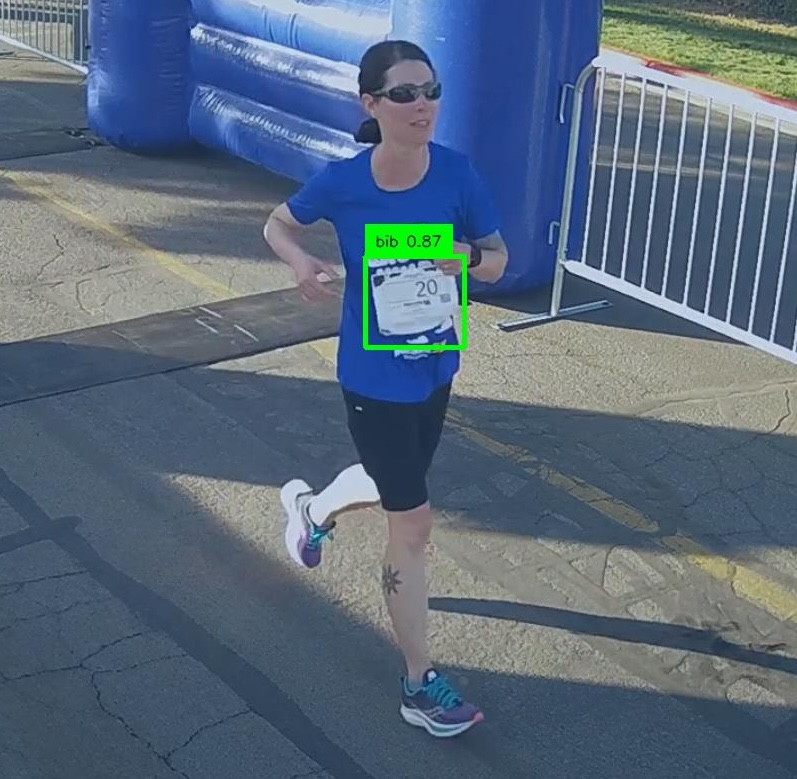
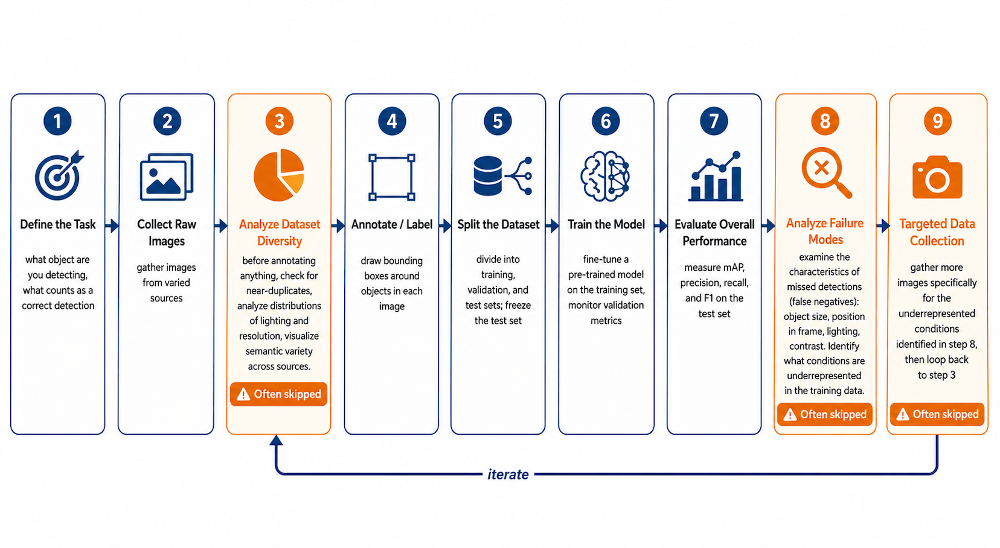
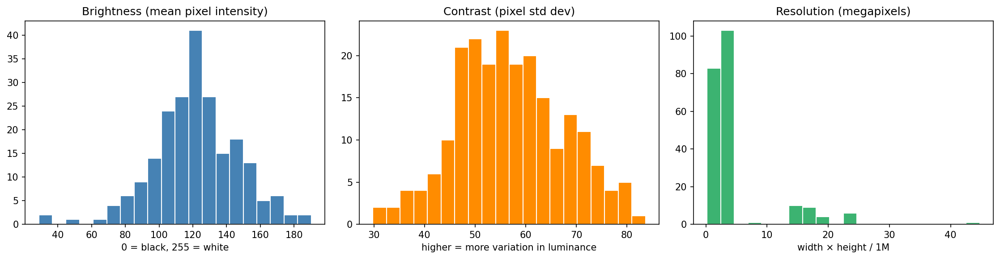
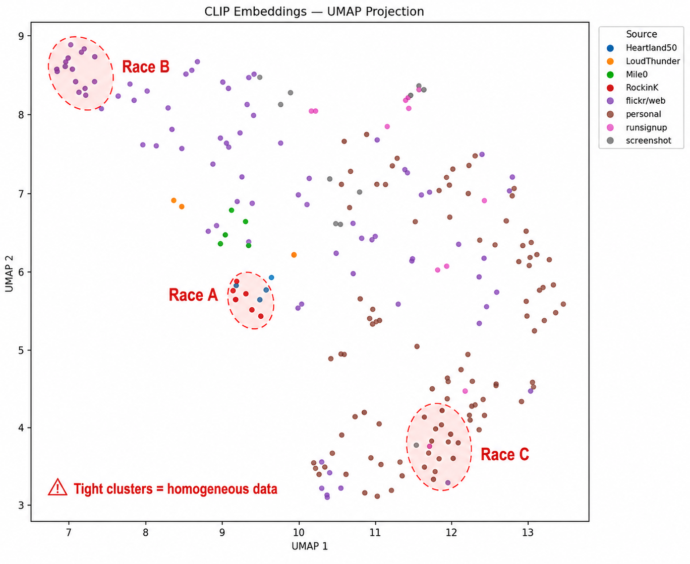
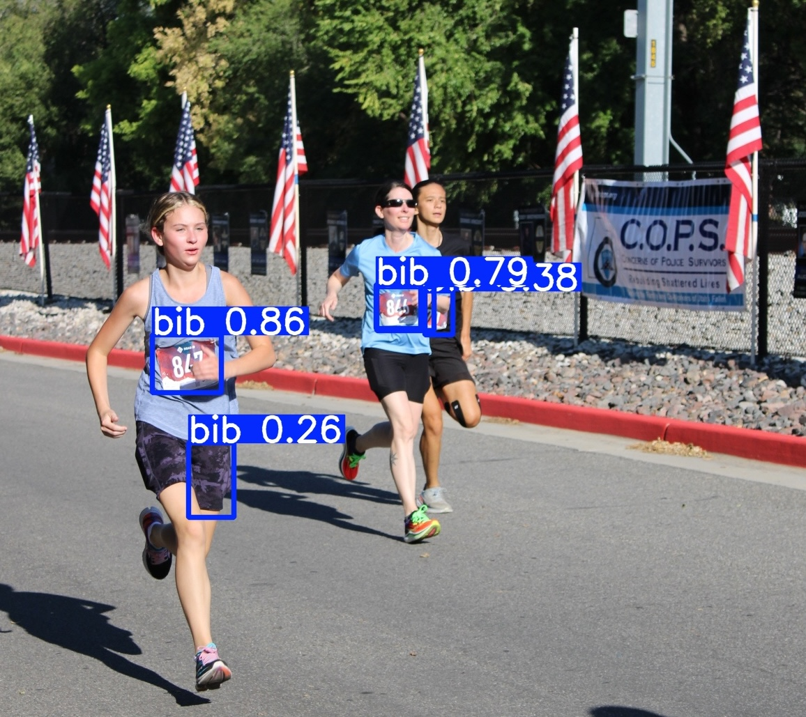
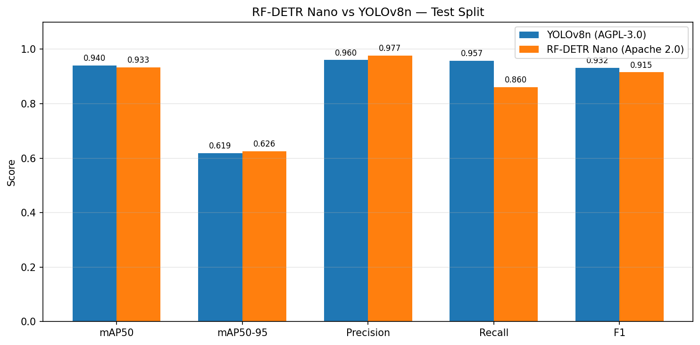
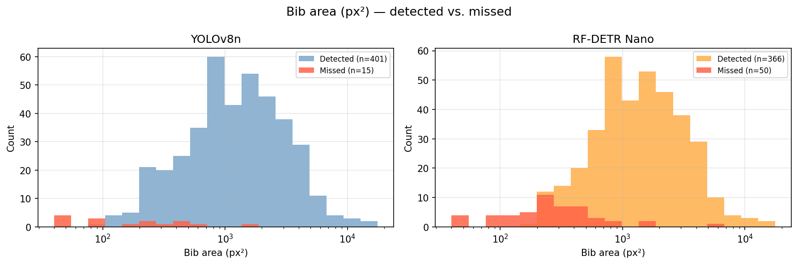
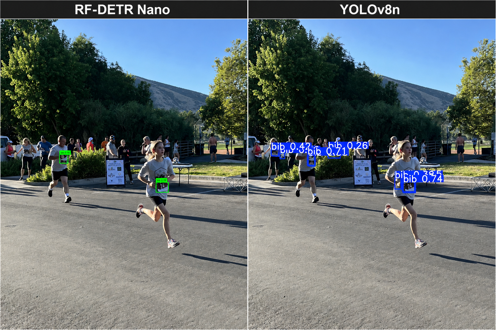

# The Dataset Is the Decision: What Training a Vision Model Taught Me About Model Selection

*I trained two object detection models on the same 217-image dataset to compare architecture choices and licensing tradeoffs.*

---

When Claude told me to find and annotate 500 images, I literally groaned. 

I build weekend projects to stay connected to the technical decisions I'm making as an engineering leader. This one was to train and compare two object detection models on race photos to identify bibs (the numbered tags pinned to runners' shirts). It seemed straightforward enough - one class, a pre-trained model with a one-command training script - but when I thought of the manual work involved in creating the dataset, the weekend timebox for this project seemed daunting.

My statistics background kept nagging at me: training data quality matters more than any model choice. Rather than just labeling more images, I wanted to understand what a quality dataset actually looks like for this task.

---

## The Project

As a follow-up to [my LLM eval piece](https://lilacmohr.com/articles/your-team-is-picking-llm-models.html), I wanted to test whether the same evaluation discipline applied to computer vision models.

An object detection model identifies what objects are in a scene and where they are, drawing bounding boxes around each one. Popular models like YOLO and RF-DETR start from weights pre-trained on millions of general-purpose images - they already recognize hundreds of common objects. Fine-tuning adapts that general knowledge to a specific task by continuing to train on a smaller, domain-specific dataset.

As a runner, I thought I'd start by fine-tuning models to detect bibs in race photos:

Unlike vision model applications where someone's life is at stake, my accuracy bar was lower - the bounding boxes needed to be directionally correct, overlapping at least 50% of the actual bib boundary. This measurement is called mAP50 (Mean Average Precision at 50% Intersection over Union).

I trained two models on the same dataset:

- **YOLOv8 nano** - the most widely deployed object detection architecture, fast, mature, and AGPL-3.0 licensed
- **RF-DETR Nano** - a newer transformer-based architecture from Roboflow, Apache 2.0 licensed

Both can be trained and used without licensing fees for experimentation. The difference that matters commercially is what happens when you deploy.

YOLOv8 is AGPL-3.0 licensed. That means: if you build a service or API that uses this model and other people access it over a network, you must release your source code under the same license. For a commercial SaaS product, that's not an option. You would need to pay Ultralytics a yearly fee for a Commercial License to keep your code closed-source.

RF-DETR is Roboflow's Detection Transformer, built on a DINOv2 vision backbone with a transformer-based detection head. Apache 2.0 licensed: use it commercially, close-source your service, no obligation.

I trained both models locally on my laptop (Apple M4 silicon) using the same dataset of 217 images, 416 hand-labeled bib annotations in Roboflow.

In the process, I learned as much about the workflow as I did about the models - specifically, the steps that matter most and that most teams skip.

---

## The Steps Most Teams Skip

Most teams treat dataset collection as a ticket - *"get 500 images of race bibs"* - rather than a design problem.

The default path is to collect data, run training script, evaluate result. But in machine learning, more data is not necessarily better. In this project, for example, if I'm trying to detect bibs from any race, training the model on 500 images from the same race is worse than training on a much smaller but more diverse dataset - 100 images across multiple races and conditions. The quantity metric is real, but it hides a quality metric that matters more: distribution.

I see the importance of context for my kids all the time. My son talks to his grandmother on video call every week. He's enthusiastic, engaged, and knows exactly who she is. But when grandma came to visit in person, he didn't recognize her at first. The context had changed. He'd seen her plenty of times, but always on the same screen.

Similarly, a model trained on homogenous data doesn't learn to detect bibs. It learns to detect bibs *at that race* - that finish line banner, that lighting condition, that camera angle, that bib font. Deploy it on a trail race in overcast conditions with a different bib design and it falls apart. And if your validation data and test data came from that same race, the results will look great, leaving you to discover the problem in production. 

In higher-stakes applications, the consequences of homogeneous training data can be severe. [A 2019 Georgia Tech study](https://www.cc.gatech.edu/news/620309/research-reveals-possibly-fatal-consequences-algorithmic-bias) found that pedestrian detection systems in self-driving cars were up to 5% less accurate at detecting people with darker skin tones - a direct result of training datasets that underrepresented them.

Two steps that address this - and that most teams skip - are Dataset Diversity Analysis and Failure Mode Analysis.

The discipline that sits between "we have data" and "we train the model" is **Exploratory Data Analysis** (EDA) - and it's the step most tutorials skip. For vision models specifically, the critical subset is **Dataset Diversity Analysis**: understanding not just how many images you have, but how varied they are across lighting conditions, venues, distances, and image quality. Three tools did the most work:

**Perceptual hashing** finds near-duplicates. Race photographers shoot in bursts - a five-second finish line sequence produces 40 nearly identical images. If those end up split across training and validation sets, your validation metrics are flattering you: the model is essentially measuring memory, not learning. Running this takes minutes and costs nothing. Run it before you label anything.

**Brightness and resolution distributions** quantify how narrow your data conditions are. A brightness histogram with a sharp spike means your dataset probably came from one time of day at similar venues. The model will struggle with overcast conditions, evening races, or any lighting it hasn't seen. Resolution matters specifically for small object detection: a bib on a runner in the background of a crowd shot might be 30×15 pixels. If the training set doesn't have small objects, the model never learns to detect at that scale. (This came back in the results.)

Brightness and contrast both show reasonable spread - the dataset isn't locked to a single lighting condition. The resolution chart tells the more important story: the vast majority of images are clustered at 2–4 megapixels, with only a handful of higher-resolution images in the tail. That spike is a direct signal that the dataset was thin on high-resolution images of distant runners - exactly where bibs appear as small, hard-to-detect objects. This came back in the results: bib size was the dominant predictor of missed detections, and both models missed bibs at the lower end of the size range because they'd barely seen them in training.

**CLIP embeddings projected with UMAP** is the most powerful tool and the one most engineering teams have never encountered. CLIP converts images into numerical vectors that capture semantic content - similar images cluster near each other. UMAP projects those high-dimensional vectors down to two dimensions. The output is a scatter plot where each dot is one image, colored by source. What you're looking for is interleaving: images from different sources spread across the plot, not tight clusters that map to a single race. A cluster that corresponds to one source means those images are semantically redundant.

*The dots in this dataset are well-mixed across sources - no tight single-color clusters. The annotated ellipses show what the plot would look like if all images came from just a few races.*

Final dataset: 217 images across 8 sources, varied lighting, terrain, and race types. 174 training images, 22 validation, 21 test - the test set held out and never touched until final evaluation.

The parallel to the LLM eval setup is direct: in that project, defining the gold standard and freezing the test set before running any models was what made the comparison meaningful. Here, understanding the dataset composition before labeling served the same function. The methodology decision comes first. Once you skip it, everything downstream is building on sand.

---

## YOLOv8n: The Baseline

YOLOv8 nano is the smallest variant of the most widely used object detection family. Three million parameters, roughly 10ms inference per image on Apple M4, a mature codebase with years of community documentation behind it.

Training ran for 89 epochs. The model peaked at epoch 75; early stopping correctly halted at 89 and saved the best weights. **Final test set results** (21 images, 50 ground-truth bibs):

| Metric | Score |
|--------|-------|
| mAP50 | 0.940 |
| mAP50-95 | 0.619 |
| Precision | 0.960 |
| Recall | 0.957 |
| F1 | 0.932 |
| False Positives | 5 |
| False Negatives | 2 |

0.940 mAP50 on a first run with 174 training images is a strong result. Transfer learning does most of the work: YOLOv8n starts from weights pretrained on millions of general images, so it already knows how to parse visual structure. Fine-tuning on 174 images redirects that knowledge toward one specific task.

The gap between mAP50 (0.940) and mAP50-95 (0.619) matters for how you define the task. mAP50 asks "did you find it?" - the predicted box needs to overlap the actual bib by 50%. mAP50-95 averages accuracy across overlap thresholds from 50% all the way up to 95%. The large gap means the model reliably finds bibs but draws boxes that are sometimes too large, too small, or slightly offset. For a "is there a bib in this photo?" use case, this is fine. For reading the bib number via OCR on the cropped region, you need both scores high.

The 5 false positives averaged 0.579 confidence; the 48 true positives averaged 0.844. A 0.265-point gap between correct and incorrect detections is a good calibration signal - when the model is wrong, it "knows" something is off.

*The detection on the running shorts - "bib 0.26" - is a false positive. The model's confidence there (0.26) is well below the 0.844 average for correct detections, which reflects good calibration: the model is less certain when it's wrong. At the default confidence threshold of 0.25, this low-confidence detection still makes it through. Raising the threshold to 0.50 would filter it out, along with other uncertain predictions. That tradeoff - higher precision in exchange for occasionally missing a real but borderline bib (like the one of the furthest runner in this photo at 0.38) - is a tuning decision that depends on what matters more in the deployment context.*

---

## The Model Comparison

I trained RF-DETR Nano on the same 217-image dataset with the same compute budget and evaluation methodology.

**One operational caveat before the numbers:** RF-DETR saves three checkpoint files during training - the regular best, the EMA (smoothed) best, and the end-of-training checkpoint. My first evaluation used the wrong one (end-of-training rather than EMA best) and got dramatically worse results. Similarly, when computing mAP manually, pre-filtering detections by confidence before calling a metric library truncates the precision-recall curve and produces a lower score than the model actually achieves. The corrected methodology revealed RF-DETR is substantially more competitive than the initial numbers suggested. The parallel to the LLM eval is exact: methodology determines what you're measuring, and wrong methodology is invisible until you check it.

**Test set comparison** (21 images, 50 ground-truth bibs):

| Metric | YOLOv8n (3M params) | RF-DETR Nano (6.5M params) |
|--------|---------------------|---------------------------|
| mAP50 | **0.940** | 0.933 |
| mAP50-95 | 0.619 | **0.626** |
| Precision | 0.960 | **0.977** |
| Recall | **0.957** | 0.860 |
| F1 | **0.932** | 0.915 |
| False Positives | 5 | **1*** |
| False Negatives | **2** | 7 |
| License | AGPL-3.0 | **Apache 2.0** |

*RF-DETR's single false positive was a background runner's bib that wasn't annotated - the model was right, the label was missing.*

*The models trade wins depending on which metric you look at. RF-DETR edges ahead on precision (0.977 vs 0.960) and localization quality (mAP50-95: 0.626 vs 0.619). YOLOv8n leads on recall (0.957 vs 0.860) - it misses fewer bibs. The recall gap is the most operationally meaningful difference.*

The mAP50 headline numbers - 0.940 vs 0.933 - are close enough that random variation in a 21-image test set explains some of the gap. Both models are near the ceiling for this dataset size.

The recall gap is real and consistent. YOLOv8n found 48 of 50 bibs; RF-DETR found 43. That pattern held across training and validation splits - RF-DETR missed about 1 in 8 training bibs even on data it was trained on, which looks structural rather than a generalization issue.

RF-DETR's single false positive turned out to be a labeling error: a real bib that was genuinely present in the image but not annotated. When a model consistently fires on something with no label, the question cuts both ways - the model might be right. Consistent discrepancies between predictions and labels are worth checking as potential annotation gaps, not just prediction errors.

---

## What Actually Determines Whether a Bib Gets Detected

This is the second step most teams skip: **Failure Mode Analysis**.

YOLOv8n hit 0.940 mAP50. RF-DETR Nano hit 0.933 mAP50. If your target is 90%, both models cleared it. The natural instinct is to pick one, close the notebook, and ship. That instinct is worth resisting.

A headline accuracy number tells you how often the model is right. It doesn't tell you *when* it's wrong, *what* it's missing, or whether the failures are random noise or a systematic gap that will surface predictably in production. Two models can have the same mAP50 with completely different failure distributions - one misses small distant bibs, the other misses edge-of-frame bibs. Those failure modes have different operational consequences and different fixes. You can't see any of that from the headline number alone.

After training both models, I ran a failure analysis across all 217 labeled images: extract every bib annotation, compute attributes (size, brightness, contrast, sharpness, position in frame), and compare detected bibs to missed ones. The gap was obvious.

**Bib size explains almost everything.**

| Model | Median area of detected bibs | Median area of missed bibs |
|-------|------------------------------|---------------------------|
| YOLOv8n | 1,218 px² | 189 px² |
| RF-DETR Nano | 1,391 px² | 236 px² |

The bibs both models miss are roughly **six times smaller** than the bibs they detect. A 189 px² bib is about 14×14 pixels - a runner 50 meters from the camera. A 1,218 px² bib is about 35×35 pixels - a runner at 10 meters. This holds across all three splits and both architectures.

*Missed bibs (red) cluster at the left edge of the distribution - 100 to 300 px² - while detected bibs peak around 1,000 px². The separation is nearly complete. Both models fail in the same size range, which points to a training data gap rather than an architecture limitation.*

Here's what that looks like on the same image:

*RF-DETR Nano finds the two foreground bibs and stops there. YOLOv8n finds those plus a background runner's bib - but also generates several low-confidence detections in the crowd. This is the precision/recall tradeoff made concrete: RF-DETR is more conservative, YOLOv8n casts a wider net. Neither model picks up the most distant runners, where bibs are smallest.*

The training set's median bib area was 1,224 px². Bibs in the 200–400 px² range - the failure zone - were a small minority of training examples. The models haven't learned to handle the lower end of the bib size range because they've barely seen it. This is the direct consequence of a gap that Dataset Diversity Analysis would have caught before labeling: the training distribution was thin at exactly the object sizes where the models would later fail.

This also illustrates something worth carrying into any ML project: switching architectures won't fix a training data problem. Adding 50–100 images specifically of distant runners - where bibs appear as 10–20 pixel objects - would directly address the primary failure mode for both models equally. More architecture is not a substitute for understanding your data.

The sharpness finding is counterintuitive and worth flagging: missed bibs appeared in *sharper* images, not blurrier ones. This is confounding. Telephoto lenses capture distant runners clearly - sharp image, small bib. When bib size is the dominant predictor of failure, any attribute that correlates with small bibs will appear to correlate with misses. Chasing a correlation without checking for confounds would send you in the wrong direction.

**The one meaningful architectural difference in failure modes:** RF-DETR misses edge-of-frame bibs at nearly twice the rate of YOLOv8n (1.97x distance-from-center ratio versus 1.37x). RF-DETR runs at 560px versus YOLOv8n's 640px; edge regions are more likely to be cropped or represented at lower effective resolution. The worst single case: a crowd scene with 25 bibs where RF-DETR missed 15 and YOLOv8n missed 3.

---

## Making the Architecture Decision

This project was too small to make confident claims about which architecture is "better" - the nano variants of both models are at the lower end of what each family offers, and 174 training images is a thin dataset by production standards. What the experiment does reveal are the tradeoffs worth working through when evaluating these architectures for a similar task.

**Recall vs. precision:** YOLOv8n found 48 of 50 bibs; RF-DETR found 43. If missing a detection is more costly than a false alarm - a person detection system, a safety inspection pipeline - that gap is meaningful. If false positives carry a higher operational cost, RF-DETR's more conservative behavior is worth something.

**Licensing as a constraint:** This belongs at the beginning of the decision, not the end. AGPL-3.0 means any network-accessible service using the model must open-source that service - a real constraint for commercial SaaS, which would require a paid Ultralytics commercial license. Apache 2.0 has no such requirement. Treat this the same way you'd treat a latency or availability constraint: establish it first, then evaluate models that actually fit.

**Localization quality:** RF-DETR edged ahead on mAP50-95 (0.626 vs 0.619), meaning its bounding boxes were slightly tighter on average. If downstream processing depends on tight crops - reading bib numbers via OCR, for example - that's relevant.

**Ecosystem maturity:** YOLOv8n has years of community documentation, integrations, and deployment patterns behind it. RF-DETR is newer. For a team without deep CV experience, the gap in available resources is a practical consideration.

The point isn't that one model is the right answer. It's that these tradeoffs exist, they can be measured, and the right choice depends on what "works" means in the specific deployment context - which has to be defined before the metric table means anything.

---

## Questions Engineering Leaders Should Be Asking

In the LLM piece, I noted that teams skip the calibration test - and if your pipeline uses a confidence score to route cases to human review, an uncalibrated model means your human review safety net isn't catching what you think it's catching. Vision models have the same gap, one step earlier.

If your team is building vision systems, or any ML product that depends on training data:

**"Where did the data come from, and how many distinct sources?"** A single-source dataset is a red flag regardless of size. Ten thousand images from one venue can be less useful than a thousand images from ten varied sources. Ask to see the source breakdown.

**"Have you done a Dataset Diversity Analysis, and what did you find?"** If the answer is "we looked at some images and it seemed fine," that's not an analysis. Ask to see the diversity visualization. Ask what the object size distribution looks like. Ask where the training distribution is thin.

**"What does a failure look like, and have you gone looking for it?"** The most useful evaluation is not the mAP number on the validation set - it's whether the team has deliberately tested on images that look different from the training data. What conditions are underrepresented? What does the model do in those conditions?

**"What's the license, and does it fit our deployment model?"** This belongs at architecture decision time, not after training is complete. AGPL-3.0 and Apache 2.0 have materially different implications for commercial products.

**"What would you do differently with the dataset if you had another week?"** A team that has done a real Dataset Diversity Analysis will have a specific answer: more images of distant runners, more low-light examples, more coverage of a specific race type. A team that hasn't will say "probably get more data."

---

## The Same Problem at a Different Layer

Both projects came back to the same problem: the visible output looks fine, so most teams stop there.

In the LLM pipeline: GPT-4o-mini produced coherent reasoning, valid schemas, and plausible-sounding assessments. It was barely better than random. You needed the eval to see it.

In the vision project: a dataset that looked diverse turned out to be almost entirely from the same finish line and lighting conditions. You needed the distribution analysis to see it.

Both are cases where the visible artifact - model output, dataset size - appeared good while the underlying quality was not. And in both cases, the work to find the gap was a weekend, not a quarter. Run the eval. Run the Dataset Diversity Analysis. The cost of not knowing is paid in production.

The code for this project, including the EDA notebooks and training scripts, is available at [github.com/lilacmohr/race-vision](https://github.com/lilacmohr/race-vision). The LLM eval framework is at [github.com/lilacmohr/pr-impact-analyzer](https://github.com/lilacmohr/pr-impact-analyzer).

---
